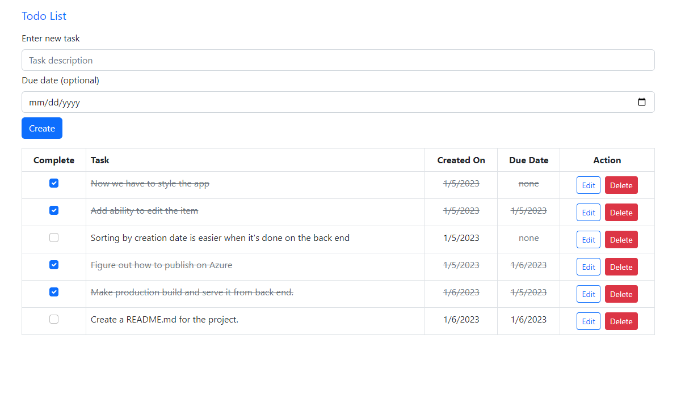

# Full-stack Todo List App

### Check out the live version of the app [here](https://et-todos.azurewebsites.net/).



This is a simple todo list tracker using a .NET Core Web API backend. Persistence is managed with a PostreSQL database. The front end UI is written in TypeScript using the React framework and is styled with React-Bootstrap.

## Running the app locally

1. Clone the [repository](https://github.com/et-codes/todos-app) into a local project folder.
1. Navigate to the `client-app` directory and type `npm install` to install the required dependencies.
1. You'll need a database. The production database is hosted on [ElephantSQL](https://www.elephantsql.com/), so the most straight-forward way to set up a local instance will be to create your own ElephantSQL instance, and add the databse URL as a connection string called `DefaultConnection` to `appsettings.json` in the `API` folder. It should look something like this:

   ```json
     "ConnectionStrings": {
         "DefaultConnection": "postgres://[id]:[pw]@[db].db.elephantsql.com/[db]"
       }
   ```

1. There is a method called that parses the ElephantSQL URL into a usable connection string, so if you use some other PostgreSQL server, you may need to bypass that by modifying this section of `./API/Program.cs`:
   ```C#
   builder.Services.AddDbContext<TodoDbContext>(opt =>
   {
       string urlString = builder.Configuration.GetConnectionString("DefaultConnection");
       opt.UseNpgsql(ConnectionString.Parse(urlString));
   });
   ```
1. Navigate to the `./API` directory and type `dotnet run` to start the backend.
1. Navigate to the `./client-app` directory and type `npm start` to run the front end.
1. Open `http://localhost:3000` in your web browser and enjoy!

## Author

Eric Thornton | [LinkedIn](https://www.linkedin.com/in/ethornton/) | [Twitter](https://twitter.com/eric__thornton)
